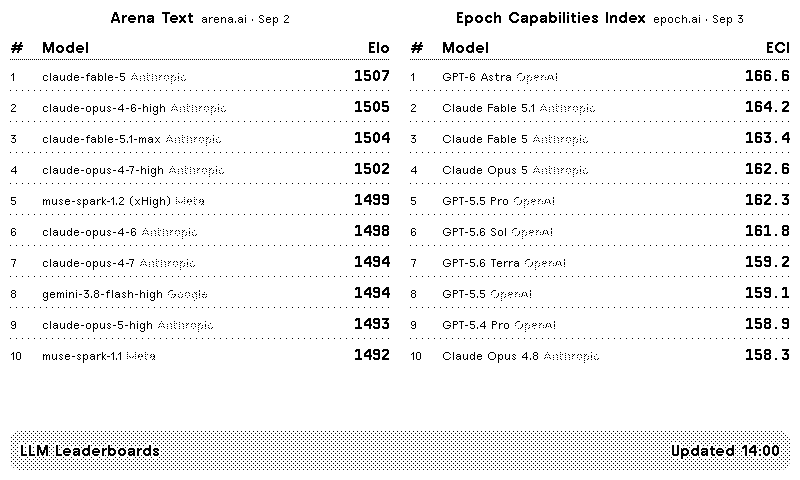
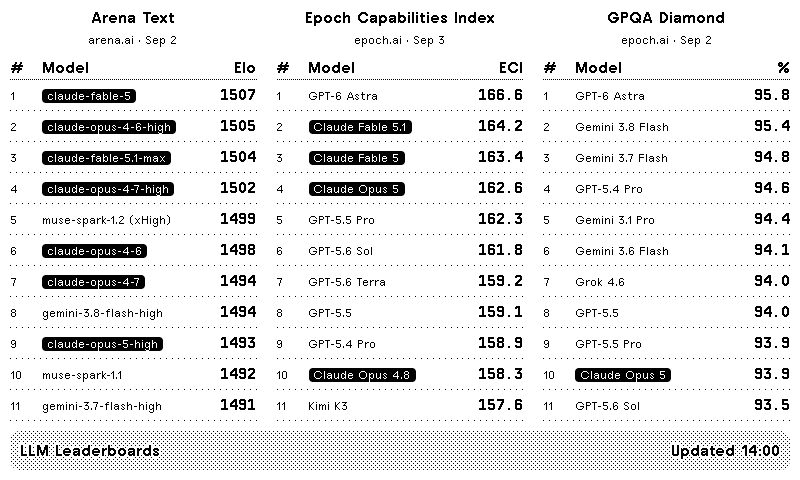

# LLM Leaderboards

A [TRMNL](https://trmnl.com) e-ink plugin showing the top models on the main LLM benchmark leaderboards, up to three side by side. Nothing to host: TRMNL runs a small Serverless function that fetches the leaderboards you picked and trims them to what fits on the screen.

Available leaderboards:

| Source | Leaderboards | Notes |
|---|---|---|
| [Arena](https://arena.ai) (formerly LMArena) | Text, Code, Vision, Search | Human-preference Elo, via the daily JSON snapshots of [arena-ai-leaderboards](https://github.com/oolong-tea-2026/arena-ai-leaderboards) |
| [Epoch AI](https://epoch.ai/benchmarks) | Epoch Capabilities Index, GPQA Diamond, Humanity's Last Exam, SWE-bench Verified, Terminal-Bench, Aider Polyglot, FrontierMath (tiers 1-3 and tier 4), ARC-AGI-2, SimpleQA Verified, OTIS Mock AIME, OSWorld 2.0, METR Time Horizon | One row per model (best run across reasoning efforts and agent scaffolds). Data CC BY 4.0 |
| [LiveBench](https://livebench.ai) | Overall, Reasoning, Coding, Agentic Coding, Mathematics | Score computed like the official table (mean of the category averages) |
| [Artificial Analysis](https://artificialanalysis.ai) | Intelligence, Coding and Agentic indices | Needs a free API key (100 requests per day) |

Each leaderboard shows rank, model, organisation, score, and the source with the date of its latest data. Models matching the "Highlight" words are inverted, and an "open-weights only" switch keeps the open models with their real ranks. All four TRMNL screen formats are supported (full, both halves, quadrant for mashups). On-screen labels are available in English and French, auto-detected from the TRMNL account language or forced in the settings.





## Prerequisites

- A TRMNL account with the **Developer Edition** (required for private plugins).
- Optional, for the Artificial Analysis leaderboards: a free API key from [artificialanalysis.ai/data-api](https://artificialanalysis.ai/data-api). The other sources need no key.

## Installing on TRMNL

Push the plugin from this repository with [trmnlp](https://github.com/usetrmnl/trmnlp):

```sh
gem install trmnl_preview     # or Docker, see bin/trmnlp
bin/trmnlp login              # TRMNL API key (Account page)
bin/trmnlp push               # creates the private plugin on your account
```

Then open the plugin on trmnl.com and fill in the fields:

| Field | Purpose |
|---|---|
| Leaderboard 1, 2, 3 | Which leaderboards to show. The first one is on every layout, the second joins it on the full and half layouts, the third only on the full layout |
| Models per leaderboard | Rows on the full layout, 1 to 15. The TRMNL OG fits 12 (11 with three leaderboards), the TRMNL X shows them all; the half and quadrant layouts show 5 rows on the OG and up to 8 on the X |
| Open-weights models only | Keeps open-weights models where the source says which ones are (Arena, Epoch AI) |
| Highlight | Comma-separated words, e.g. `claude, mistral`: matching models are shown inverted |
| Screen title | Empty = "LLM Leaderboards" |
| Artificial Analysis API key | Only for the Artificial Analysis leaderboards |
| LiveBench version | Empty = the newest version known to the plugin; set e.g. `2026-06-25` when LiveBench publishes a new table |
| Language | On-screen labels: Auto (TRMNL account language), English or Français |

The plugin icon is in `assets/` (`icon.svg`, or `icon.png` at 512×512): upload it from the plugin's settings page.

After the first `push`, `src/settings.yml` gains an `id`: later pushes update that same plugin instead of creating a new one. With TRMNL's GitHub sync enabled on the plugin, saving on trmnl.com also commits the export to this repository.

The default refresh is every 6 hours: the sources change at most daily.

## Local development

```sh
bin/dev fixture               # preview at http://localhost:4567 with offline samples
bin/dev                       # preview with live data (add AA_API_KEY=... to .env for Artificial Analysis)
bin/trmnlp lint               # TRMNL best practices
python3 dev/smoke.py          # renders every view in many configurations and checks the output
python3 dev/fetch_samples.py  # refreshes dev/samples from the live sources
python3 dev/make_fixture.py   # rebuilds dev/fixture/.trmnlp.yml from dev/samples
```

`fixture` mode uses `dev/fixture/.trmnlp.yml`: the real snapshots of `dev/samples/` (trimmed to their best rows) injected as `sources`, with `offline: true` so the function never reaches the network, and a clock frozen at 14:00. The Artificial Analysis sample is synthetic, shaped like the documented API response.

Keep an Artificial Analysis key in `.env`, never in `.trmnlp.yml`: that file is committed by TRMNL's GitHub sync with empty custom fields. To use your own local values without ever committing them:

```sh
git update-index --skip-worktree .trmnlp.yml
```

## Repository layout

| Path | Role |
|---|---|
| `src/settings.yml` | Plugin config: polling URL, form fields, Serverless language |
| `src/transform.py` | Serverless function: fetches the selected leaderboards, normalises and ranks them |
| `src/shared.liquid` | Prepended to every view: the `board` and `title_bar` templates, EN/FR labels |
| `src/full.liquid` | Full screen, 800×480, up to three leaderboards side by side |
| `src/half_horizontal.liquid`, `src/half_vertical.liquid`, `src/quadrant.liquid` | Mashup formats |
| `assets/` | Plugin icon (SVG and 512×512 PNG) |
| `dev/` | Local tooling: samples, fixture, smoke test |
| `docs/research.md` | Research notes: sources evaluated, data formats, TRMNL constraints |

## How it works

On every refresh, TRMNL polls a 50-byte pointer to the latest Arena snapshot, then runs `src/transform.py` in the Serverless tab (Python). The function reads the selected leaderboards from the plugin fields and fetches only those:

| Source | What is fetched |
|---|---|
| Arena | `data/<date>/<board>.json` from the GitHub mirror, 4 to 7 KB |
| Epoch Capabilities Index | `https://epoch.ai/data/eci_scores.csv`, 33 KB |
| Epoch benchmark tables | `https://epoch.ai/data/benchmark_data.zip`, 2.3 MB, read once per run; the table, `benchmark_metadata.csv` (score column and scale) and `model_metadata.csv` (display names, organisations, open weights) are taken from it |
| LiveBench | `table_<version>.csv` and `categories_<version>.json` on livebench.ai |
| Artificial Analysis | `/api/v2/language/models/free` with the `x-api-key` header, one or two pages |

It returns one `boards` entry per leaderboard with at most 15 rows, which keeps the merge variables far below TRMNL's 100 KB cap. A leaderboard that cannot be loaded shows its own error message; the others still render. The function gives itself 4 seconds of network time out of TRMNL's 5 second limit, and every fetch has a timeout.

Why the function fetches instead of TRMNL polling everything: the Arena snapshot lives at a dated path that only the pointer knows, the Epoch tables are inside a zip, and only the selected leaderboards should be downloaded. TRMNL's publishing checker (Chef) flags HTTP calls in Serverless functions as a hint; the calls here are few and small. Details in `docs/research.md`.

Finally the Liquid views render the boards: `shared.liquid` defines a `board` template used by every layout, so a layout only decides how many boards and rows it shows.

## Attribution

Please keep the source names on screen: Epoch AI's data is CC BY 4.0, and Artificial Analysis requires attribution for API data. Arena data comes from arena.ai through the [arena-ai-leaderboards](https://github.com/oolong-tea-2026/arena-ai-leaderboards) mirror (MIT), LiveBench data from [livebench.ai](https://livebench.ai).

## Known limits

- The Serverless function has 5 seconds and 128 MB. Three boards from three different sources take about one second; the Epoch zip (2.3 MB) is the heaviest download.
- Arena data is a daily mirror parsed from arena.ai by a community project: the snapshot is up to a day old, and the mirror may skip a day.
- LiveBench does not expose its current version in a stable file: the version is hard-coded in `src/transform.py` and can be overridden with the "LiveBench version" field.
- The Artificial Analysis boards are untested against the live API: the function follows the documented free-tier response, and shows the HTTP status if the key is refused.
- Open-weights filtering only applies where the source publishes a licence (Arena, Epoch AI); LiveBench and the Artificial Analysis free tier do not.
